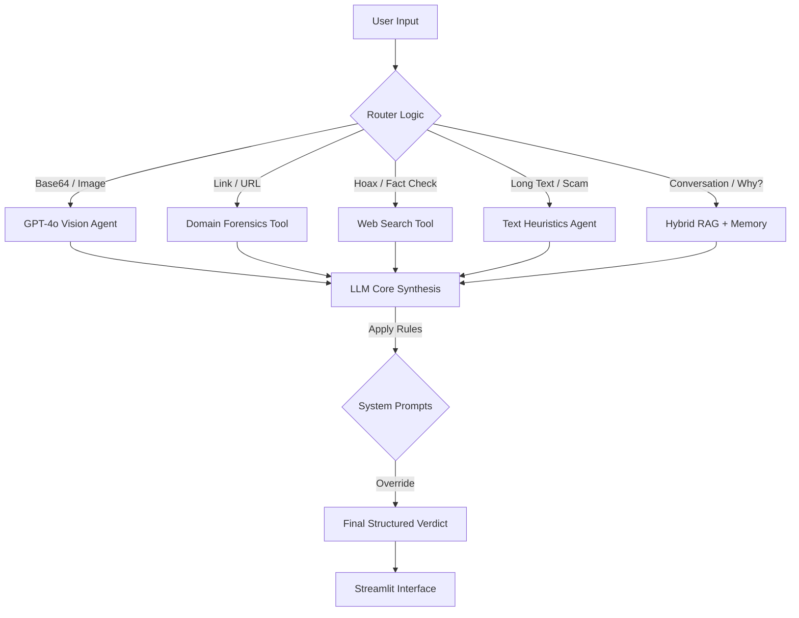

# 🛡️ Scam Shield - Digital Public Defender

> **An autonomous, multi-modal AI Agent designed to detect scams, phishing attempts, digital fraud and AI generated images in real-time.**

   

## Project Description

### The Problem
Digital fraud has evolved beyond simple email spam. Today's threats are sophisticated, personalized, and multi-modal:
* **Deepfakes & AI Imagery:** Scammers use generated images to create fake personas, products, or evidence.
* **Typosquatting:** Fake domains (e.g., `gogle.com`, `amaz0n.com`) that look identical to legitimate ones at first glance.
* **Social Engineering:** Attacks that manipulate emotions (urgency, fear, greed) rather than just using malware.

Traditional antivirus software checks files, but it doesn't understand **context** or **human intent**.

### The Solution: Scam Shield
**Scam Shield** is an intelligent "Public Defender" agent. It is not just a chatbot, it verifies facts using hard data (domain age, visual artifacts, web reputation) and uses a Large Language Model (GPT-4o) to synthesize a final, explainable verdict.

**Key Capabilities:**
* **Visual Forensics:** Detects AI-generated images and deepfakes.
* **Domain Intelligence:** Analyzes domain age via WhoIs and detects brand impersonation (Typosquatting).
* **Contextual Awareness:** Distinguishes between a scammer asking for a password and a legitimate courier sending a pickup code.

---

## System Flow & Decision Process

Sentinel uses a **Agentic Workflow**. It does not treat every input the same way. It routes the user's request to the specific tool best suited to handle it, optimizing for both speed and accuracy.

### 1. High-Level Architecture Diagram


---

## Component Breakdown

This section details the responsibility of each module in the system architecture.

### 1. The Frontend (`Root`)
* **`app.py`**
    * **Role:** The User Interface (UI) built with Streamlit.
    * **Key Functions:**
        * Manages **Session State** for multi-chat support.
        * Handles **Image Uploads** and converts them to Base64 for the backend.
        * Parses the Agent's text output using **Regex** to render color-coded security badges (HIGH RISK, SAFE).

### 2. The Brain (`src/agent/`)
* **`core.py` (The Orchestrator)**
    * **Role:** The central logic kernel that binds all components.
    * **Key Functions:**
        * **Sanitization:** Cleans input data (removes invisible characters, strips Base64 headers).
        * **Vision Logic:** Constructs the specific JSON payload required by GPT-4o Vision.
        * **Memory Cleanup:** Prevents token overflow by storing image placeholders instead of raw Base64 data in the conversation history.
        * **Execution:** Coordinates the flow: Input → Router → Tool/LLM → Output.

* **`router.py` (The Dispatcher)**
    * **Role:** Determines *what* the user wants to do.
    * **Logic:**
        * **Deterministic:** If the input contains an image signature, it routes immediately to `VISUAL_ANALYSIS` (bypassing the LLM for speed).
        * **Semantic:** For text, it uses an LLM to classify intent into: `LINK_ANALYSIS` (URL check), `TEXT_ANALYSIS` (Scam pattern), `WEB_SEARCH` (Fact check), or `GENERAL_KNOWLEDGE`.

* **`memory.py` (The Context)**
    * **Role:** Short-term conversational memory.
    * **Key Functions:**
        * Implements a **Sliding Window** mechanism (keeps only the last N messages) to optimize costs and stay within context limits.
        * Inject the System Prompt ("The Constitution") at the start of every interaction.

### 3. The Hands (`src/tools/`)
Deterministic Python functions used to validate facts objectively.

* **`scam_check.py` (Domain Forensics)**
    * **Role:** Analyzes the technical infrastructure of links and emails.
    * **Logic:**
        * Uses **Regex** to extract domains from raw text.
        * Detects **Typosquatting** (e.g., `gogle.com` vs `google.com`) using a dictionary of protected brands.
        * Queries **WhoIs** to calculate Domain Age (Rule: Age < 30 days = **Critical Risk**).

* **`text_analysis.py` (Heuristic Scorer)**
    * **Role:** First line of defense against social engineering.
    * **Logic:**
        * Scans text for keywords in categories: **Urgency** ("Immediate", "Police"), **Financial** ("Card", "PIN"), and **Spam**.
        * Calculates a mathematical Risk Score (0-100), independent of the AI's opinion.

* **`web_search.py` (Fact Checker)**
    * **Role:** Verifies viral rumors and hoaxes.
    * **Logic:** Uses `DuckDuckGo` to search for known scams (e.g., "Teresa Fidalgo scam") or reported phone numbers.

* **`image_analysis.py` (Visual Prep)**
    * **Role:** Helper for image processing.
    * **Logic:** Simulates metadata extraction and prepares the technical context for the Vision model.

### 4. The Personality (`src/prompts/`)
* **`system_prompts.py` (The Constitution)**
    * **Role:** Defines the Agent's behavior, tone, and safety guardrails.
    * **Key Rules:**
        * **Physical Location Override:** If a message invites the user to a physical location (e.g., Post Office), it is marked SAFE.
        * **Recruitment Whitelist:** Recognizes legitimate HR patterns (Google Drive links + Application context).
        * **Anti-Hallucination:** Strictly forbids inventing links that do not exist in the history.

* **`templates.py`**
    * **Role:** Enforces the output format.
    * **Logic:** Ensures every response follows the structure: `VERDICT` -> `REASONING` -> `ACTIONABLE ADVICE`.

---

## 💻 Installation & Setup

### Prerequisites
* Python 3.10 or higher
* OpenAI API Key (with GPT-4o access)

### Setup Steps

1.  **Clone the repository:**
    ```bash
    git clone [https://github.com/your-username/Sentinel-AI.git](https://github.com/your-username/Sentinel-AI.git)
    cd Sentinel-AI
    ```

2.  **Create Virtual Environment:**
    ```bash
    # Windows
    python -m venv venv
    venv\Scripts\activate

    # Mac/Linux
    python3 -m venv venv
    source venv/bin/activate
    ```

3.  **Install Dependencies:**
    ```bash
    pip install -r requirements.txt
    ```

4.  **Configure Environment:**
    Create a `.env` file in the root directory:
    ```env
    OPENAI_API_KEY=sk-proj-your-api-key-here
    ```

5.  **Run the App:**
    ```bash
    streamlit run app.py
    ```
